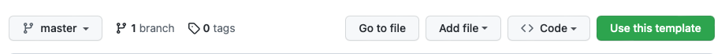
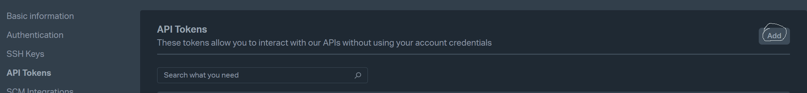
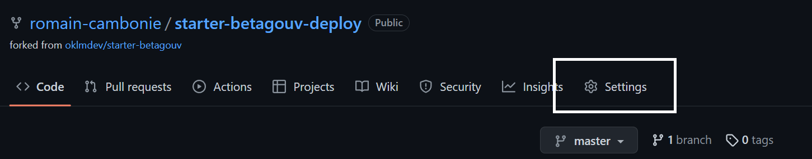
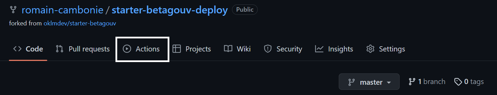
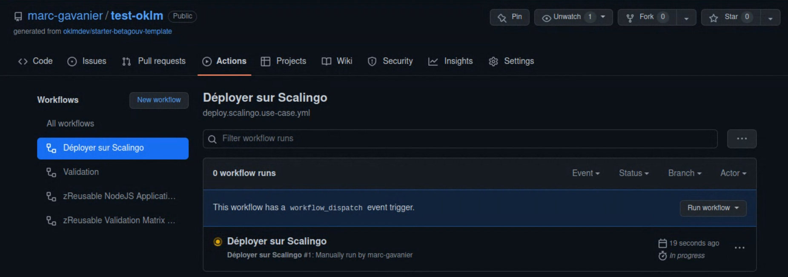
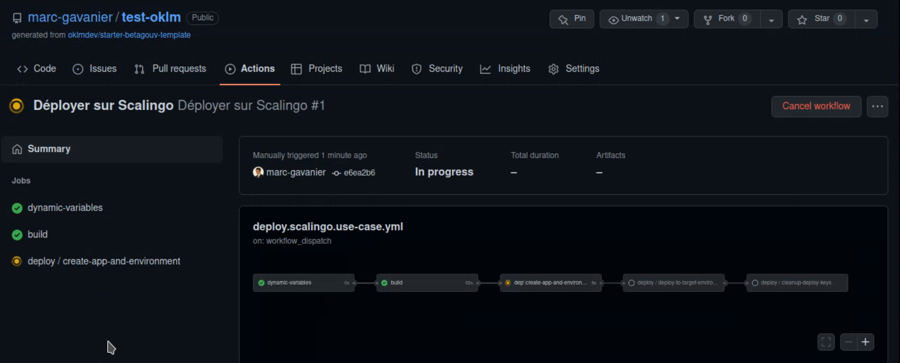
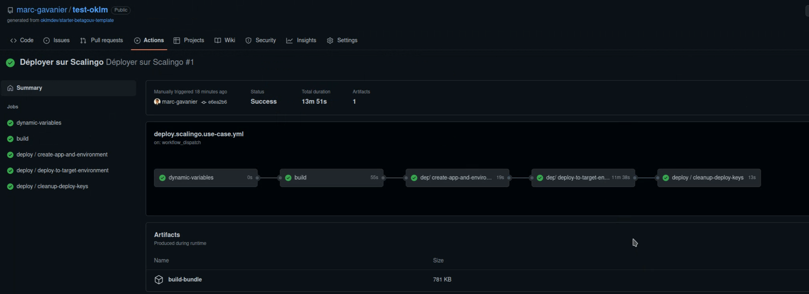
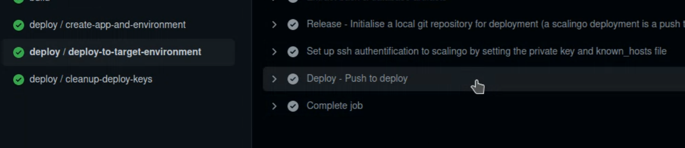
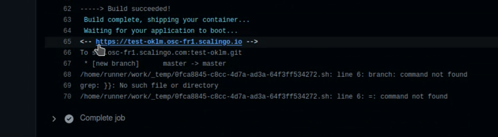

# A propos

Ce tutoriel vous guide pas-à-pas dans la mise en place de la première version du site de votre produit BetaGouv.

Vous n'avez pas besoin de savoir développer pour réaliser l'ensemble des étapes décrites ci-dessous.

L'objectif est de mettre une page web qui satisfait la norme de qualités de BetaGouv.

Dans un premier temps, vous pourrez personnaliser la page d'accueil sans l'intervention d'un développeur et ainsi avoir une présence en ligne.

Cet outil est une base sur laquelle une future équipe technique pourra itérer rapidement tout en conservant les possibilités de personnalisation.

## Déployer ma copie du starter en moins d'une heure.

### 1. Utiliser ce modèle comme point de départ  

- Le modèle est disponible sur [github](https://github.com/) vous devez donc [vous inscrire](https://github.com/signup?source=login) pour l'utiliser.
- Une fois inscrit et connectés allez sur [https://github.com/oklmdev/starter-betagouv-template](https://github.com/oklmdev/starter-betagouv-template)
- Puis cliquez sur le bouton 'Use this template' en haut à droite

- Par défaut le champ "Owner" correspond à votre identifiant GitHub, il permet de définir l'endroit où sera stocké votre version du modèle, vous pouvez utiliser l'organisation 'betagouv' en demandant à être ajouté à l'organisation sur le canal Mattermost [~incubateur-help](https://mattermost.incubateur.net/betagouv/channels/incubateur-help)
- Dans le champ "Repository name", saisissez le nom de votre produit beta.gouv.
- Cliquez sur le bouton `Create Repository from Template`

Une fois validé, et après quelques instants de chargement, vous êtes redirigés vers la page de votre modèle 👏.

### 2. Préparer la mise en ligne du modèle

Vous venez de créer votre modèle sur GitHub, maintenant vous avez besoin d'un hébergeur qui va se charger pour vous de le rendre disponible sur le web.

Nous vous proposons d'utiliser [Scalingo](https://scalingo.com/fr) qui est un [hébergeur](https://scalingo.com/fr/blog/paas-guide-complet) souverain français. 

Scalingo est l'un des hébergeurs les plus populaire de beta.gouv.

- Allez sur la [page d'inscription scalingo](https://auth.scalingo.com/users/sign_up) et créez votre compte [COMMENT GERER L'ASPECT FINANCIER ??? CB + note de frais, etc.]

Nous avons besoin de d'avoir une clef d'authentification (API token) pour permettre à Github de mettre notre modèle en ligne sur Scalingo.

- Allez sur [vos `Paramètres utilisateur`, section `Tokens API`](https://dashboard.scalingo.com/account/tokens), puis cliquez sur le bouton `Ajouter` en haut à droite.

- Donnez un nom à votre token, par exemple celui de votre produit beta.gouv
- Cliquez sur le bouton de validation
- Avant de continuer, copiez-collez la valeur du token pour pouvoir la retrouver ensuite.
- :warning: Attention ne partagez jamais ce token, car il permet un accès complet à votre compte Scalingo. :warning:
- La valeur du token ne sera plus jamais visible, si vous le perdez, il vous suffira d'en créer un nouveau de la même manière.

# 4. Autoriser GitHub à mettre en ligne le modèle sur Scalingo 

Retournez sur la page de votre modèle sur GitHub et allez dans les paramètres (menu `Settings` en haut).

- Sélectionnez la catégorie 'Secrets' puis 'Actions' dans le menu de gauche

- Cliquez sur le bouton `New Repository Secret` en haut à droite
  - Collez le token dans le champ `Secret` (le second)
  - Mettez `SCALINGO_API_TOKEN` dans le champ `Name` (le premier).
  - Validez en cliquant sur le bouton `Add Secret`

# 5. Mise en ligne

Allez dans les actions (menu `Actions` en haut).

- Cliquez sur `Déployer sur Scalingo` dans la liste des `Workflows` à gauche
- puis cliquez sur le bouton `Run workflow` à droite
- ne touchez pas à l'option `Use workflow from` qui est normalement sur `Branch: master`
- Saisissez le nom de votre produit beta-gouv en tant que nom d'application :
  - il doit être unique parmi tous les sites hébergés sur Scalingo
  - il doit faire moins de 47 caractères
  - il ne peut pas contenir 'scalingo'
- Cliquez sur `Run workflow` (en vert) 

Après un peu d'attente vous pouvez voir le lancement de la mise en ligne apparaître sur la page des workflows

En cliquant sur le titre `Déployer sur Scalingo` dans le workflow qui vient d'apparaitre, vous accédez au détail de la progression de la mise en ligne.

Au global, la mise en ligne est susceptible de prendre plus de 10 minutes

Une fois que toutes les étapes sont vertes votre site est en ligne 🎉

L'URL est le nom d'application que vous avez rentré, précédé par `https://` suivi par le domaine scalingo `.osc-fr1.scalingo.io/`, par exemple : `https://mon-produit-beta-gouv.osc-fr1.scalingo.io/`

Alternativement vous pouvez retrouver l'url dans les détails du déploiement

À la fin de l'étape de déploiement (il faut scroller un peu !)

=======
Dans sa version la plus simple il n'y a qu'un seul environment de production deployé sur [Scalingo](https://scalingo.com/fr)
Scalingo est un [PaaS](https://scalingo.com/fr/blog/paas-guide-complet) souverain français qui satisfais bien les exigences de BetaGouv.

# Déployer ma copie du starter en moins d'une heure.

## Prérequis

- Avoir un compte sur [github](https://github.com/) et être connecté.

## 1. Utiliser ce template comme point de départ du dépot

- Allez sur [https://github.com/oklmdev/starter-betagouv-template](https://github.com/oklmdev/starter-betagouv-template) et cliquez sur le bouton 'Use this template' en haut à droite

- Saisissez le nom du repo à créer puis valider la création

# 2. Créer un compte sur scalingo

- Allez sur la [page d'inscription scalingo](https://auth.scalingo.com/users/sign_up) et créez votre compte (pas besoin de mettre de moyen de paiement pour l'instant :) )

# 3. Créer un token api sur scalingo.

- Allez sur [vos paramètres de compte, section 'Tokens Api'](https://dashboard.scalingo.com/account/tokens) et cliquez sur 'Ajouter'.
- Donner un nom à votre token api puis copiez-collez sa valeur pour pouvoir la retrouver ensuite
  - Attention ne la partagez avec personne ! Ce token ne sera plus visible ensuite et permet un accès complet à votre compte Scalingo.

# 4. Renseigner le token api dans les secrets github

- Allez dans les 'Settings' du dépot de votre projet qui contient le fork du starter. (url_du_dépot/settings)
- Sélectionnez la catégorie 'Secrets' puis 'actions' dans le menu de gauche

- Créez un 'New Repository Secret' avec
  - pour nom 'SCALINGO_API_TOKEN'
  - pour valeur le token api scalingo copié précédement.
- Validez en cliquant sur 'Add Secret'

# 5. Lancer l'action de déploiement

- Allez dans les 'Actions' du dépot de votre projet (url_du_dépot/actions)
- Validez l'activation des actions en cliquant sur 'I understand my workflows, go ahead and enable them'
- 

- Cliquez sur 'Déployer sur Scalingo' dans la liste des Workflows
  - puis cliquez sur le bouton 'Run workflow'
  - puis encore sur la confirmation Run workflow avec l'option 'Use workflow from' active sur 'master'
